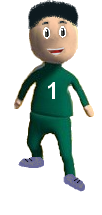
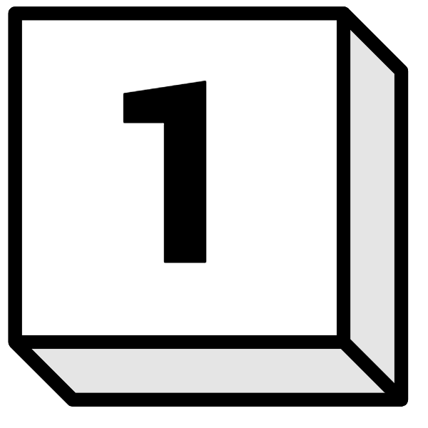
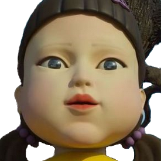
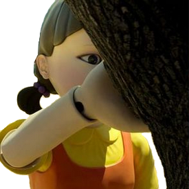

# Red Light Green Light

### **This project is a game made with HTML5, Canvas, CSS3 and JavaScript.**

 

_Red light and green light is a game inspired in the "Squid Game" series, ilustrating a fun version of the history's first game._

 

👾 [Click here to play](https://tatianaprada.github.io/red-light-green-light)

---

## Instruccions

**The objective of the game is all squid game players arrived to the save zone (green line) before the time is over:**

1. Press the "Start" button and be sure you can listen the sound of the game. 🔈
2. Activate the movement of all players with the space bar.

3. The players only can be in movement while the doll is singing, you have to stop each player pressing the corresponding number key:

 Each player has a number, press its number to stop the player.

 The doll stops to sing when she is looking to you. Be sure that you have all the players stoped.

4. When the doll starts to sing again, you can activate the player's movement:

 Be sure to stop again all the players when the doll stop to sing, you can repeat these steps until the time is over.

---

When you save all the players, your price will be a piggy bank, and you can play again.

---

If the time is over or you don't all players, the game is over. You will be able to try again.

